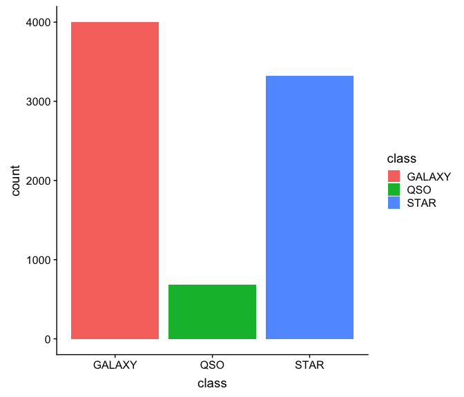
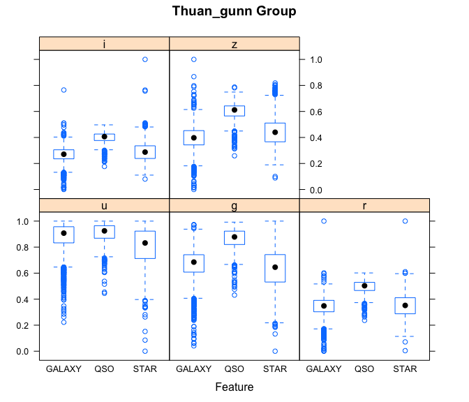
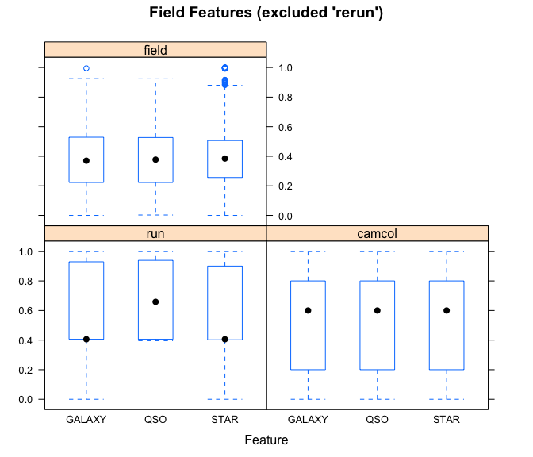
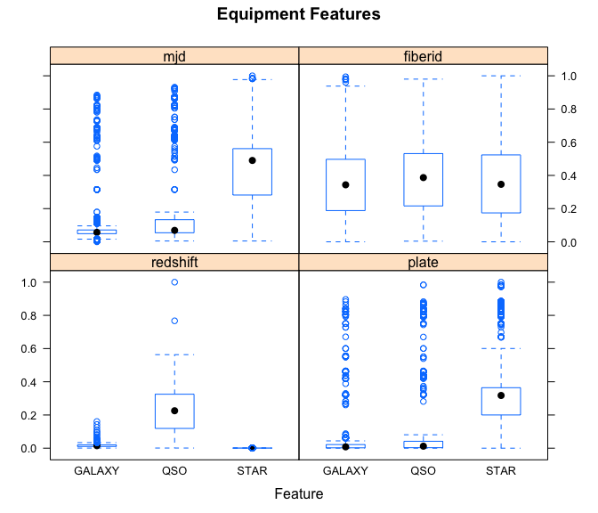
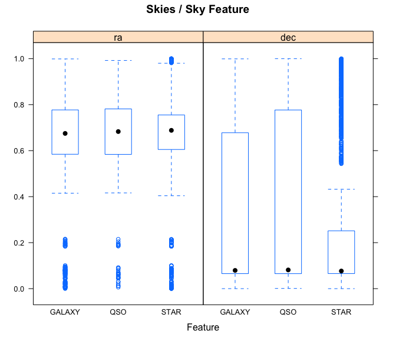
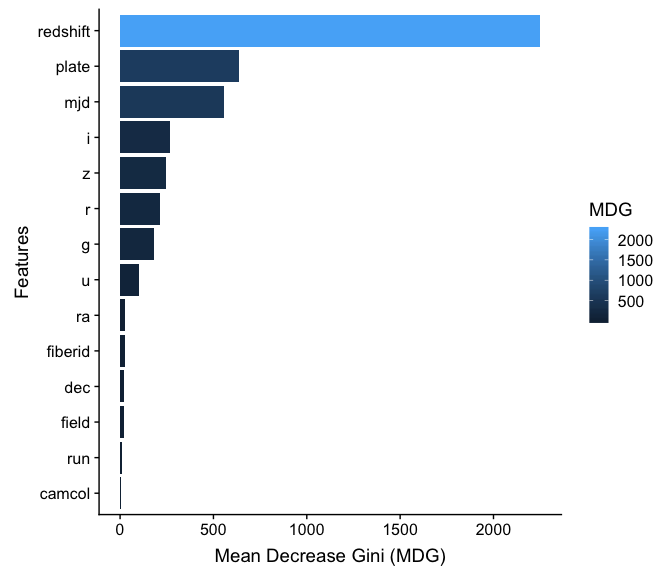
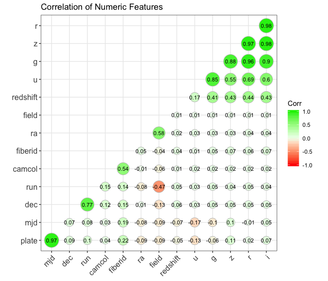
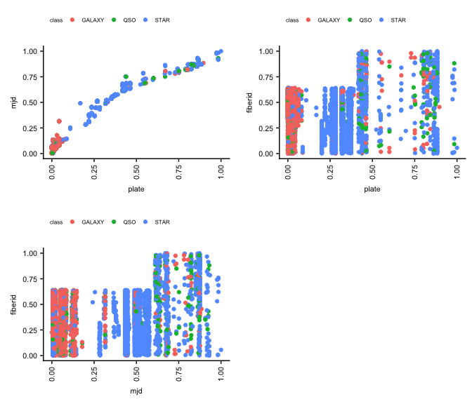
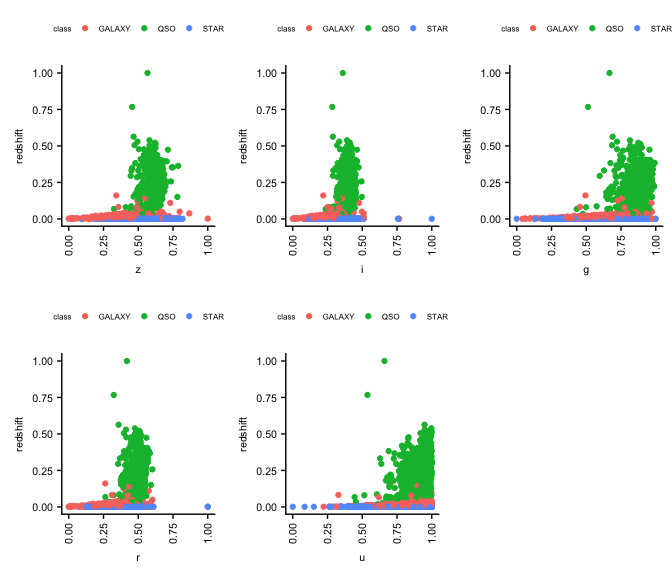

## 1 Introduction  

### 1.1 Content  

The Sloan Digital Sky Survey offers public data of space observations and the task here is to build a model that is able to predict the different classes of objects (Stars, Galaxies and Quasars) based on the data acquired through the scientific equipment.
The data consists of 10,000 observations of space taken by the SDSS. Every observation is described by 17 feature columns and 1 class column which identifies it to be either a star, galaxy or quasar.  
Our model achieved an **accuray** of 0.9915019

### 1.2 Feature Description  

The table results from a query which joins two tables (actuaclly views): "PhotoObj" which contains photometric data and "SpecObj" which contains spectral data.

During our data exploratory analysis we will be explaining the features as they appear.

*The data released by the SDSS is under public domain. Its taken from the current data release RD14.*  

## 2 Downloading Installing and Starting R

### 2.1 Installing the DataSet  

The url can be found here: https://www.kaggle.com/lucidlenn/sloan-digital-sky-survey/version/1

### 2.2 Libraries used  

```r
library(tidyverse)
library(data.table)
library(caret)
library(ggplot2)
library(ggcorrplot)
library(RSNNS)
library(randomForest)
library(ggcorrplot)
library(kernlab)
library(cowplot)
```

```
## Warning: package 'cowplot' was built under R version 3.5.2
```

## 3 Load The Data


```r
sky.df <- fread(file = "Skyserver_SQL2_27_2018 6_51_39 PM.csv", sep=",") # load the data and save for use.
```

### 3.1 Create a Validation Dataset

```r
# create a list of 80% of the rows in the original dataset we can use for training
index <- createDataPartition(sky.df$class, p=0.8, list=FALSE)
# select 20% of the data for validation
validation <- sky.df[-index,]
# use the remaining 80% of data to training and testing the models
sky.train <- sky.df[index,]
```

## 4 Summarize Dataset  
### 4.1 Structure, summary, NA's check, and dimensions

```r
str(sky.train)
```

```
## Classes 'data.table' and 'data.frame':	8001 obs. of  18 variables:
##  $ objid    :integer64 1237648704577142822 1237648704577142859 1237648704577208477 1237648704577273909 1237648704577273970 1237648704577273992 1237648704577274016 1237648704577339400 ... 
##  $ ra       : num  184 184 184 184 184 ...
##  $ dec      : num  0.0897 0.1353 0.1262 0.1026 0.1737 ...
##  $ u        : num  19.5 18.7 19.4 17.6 19.4 ...
##  $ g        : num  17 17.2 18.2 16.3 18.5 ...
##  $ r        : num  15.9 16.7 17.5 16.4 18.2 ...
##  $ i        : num  15.5 16.5 17.1 16.6 18 ...
##  $ z        : num  15.2 16.4 16.8 16.6 18 ...
##  $ run      : int  752 752 752 752 752 752 752 752 752 752 ...
##  $ rerun    : int  301 301 301 301 301 301 301 301 301 301 ...
##  $ camcol   : int  4 4 4 4 4 4 4 4 4 4 ...
##  $ field    : int  267 267 268 269 269 269 269 270 270 270 ...
##  $ specobjid: chr  "3722360139651588096" "363814405953054720" "323274319570429952" "3722365912087633920" ...
##  $ class    : chr  "STAR" "STAR" "GALAXY" "STAR" ...
##  $ redshift : num  -8.96e-06 -5.49e-05 1.23e-01 5.90e-04 3.15e-04 ...
##  $ plate    : int  3306 323 287 3306 324 287 3306 323 288 3306 ...
##  $ mjd      : int  54922 51615 52023 54922 51666 52023 54922 51615 52000 54922 ...
##  $ fiberid  : int  491 541 513 512 594 559 515 595 400 506 ...
##  - attr(*, ".internal.selfref")=<externalptr>
```

```r
summary(sky.train)
```

```
##      objid                           ra               dec         
##  Min.   :1237646798137852371   Min.   :  8.235   Min.   :-5.3826  
##  1st Qu.:1237648705652523052   1st Qu.:157.809   1st Qu.:-0.5441  
##  Median :1237648722294735005   Median :180.395   Median : 0.3932  
##  Mean   :1237649689013074910   Mean   :175.619   Mean   :14.7335  
##  3rd Qu.:1237651191889985714   3rd Qu.:201.254   3rd Qu.:26.4956  
##  Max.   :1237651540334215473   Max.   :260.884   Max.   :68.5406  
##        u               g               r               i        
##  Min.   :12.99   Min.   :12.80   Min.   :12.43   Min.   :11.95  
##  1st Qu.:18.18   1st Qu.:16.81   1st Qu.:16.17   1st Qu.:15.85  
##  Median :18.85   Median :17.49   Median :16.86   Median :16.55  
##  Mean   :18.62   Mean   :17.37   Mean   :16.84   Mean   :16.58  
##  3rd Qu.:19.26   3rd Qu.:18.01   3rd Qu.:17.51   3rd Qu.:17.26  
##  Max.   :19.60   Max.   :19.66   Max.   :24.80   Max.   :28.18  
##        z              run             rerun         camcol     
##  Min.   :11.61   Min.   : 308.0   Min.   :301   Min.   :1.000  
##  1st Qu.:15.62   1st Qu.: 752.0   1st Qu.:301   1st Qu.:2.000  
##  Median :16.38   Median : 756.0   Median :301   Median :4.000  
##  Mean   :16.42   Mean   : 981.3   Mean   :301   Mean   :3.639  
##  3rd Qu.:17.14   3rd Qu.:1331.0   3rd Qu.:301   3rd Qu.:5.000  
##  Max.   :22.83   Max.   :1412.0   Max.   :301   Max.   :6.000  
##      field      specobjid            class              redshift        
##  Min.   : 11   Length:8001        Length:8001        Min.   :-0.004136  
##  1st Qu.:184   Class :character   Class :character   1st Qu.: 0.000077  
##  Median :298   Mode  :character   Mode  :character   Median : 0.043023  
##  Mean   :301                                         Mean   : 0.141711  
##  3rd Qu.:404                                         3rd Qu.: 0.092100  
##  Max.   :768                                         Max.   : 5.353854  
##      plate           mjd           fiberid      
##  Min.   : 266   Min.   :51578   Min.   :   1.0  
##  1st Qu.: 300   1st Qu.:51900   1st Qu.: 186.0  
##  Median : 441   Median :51997   Median : 349.0  
##  Mean   :1467   Mean   :52949   Mean   : 352.8  
##  3rd Qu.:2559   3rd Qu.:54468   3rd Qu.: 511.0  
##  Max.   :8410   Max.   :57481   Max.   :1000.0
```

```r
colSums(is.na(sky.train)) # any NA's?
```

```
##     objid        ra       dec         u         g         r         i 
##         0         0         0         0         0         0         0 
##         z       run     rerun    camcol     field specobjid     class 
##         0         0         0         0         0         0         0 
##  redshift     plate       mjd   fiberid 
##         0         0         0         0
```

```r
dim(sky.train)
```

```
## [1] 8001   18
```

### 4.2 Types of attributes

```r
sapply(sky.train, class) # checking the class of every feature
```

```
##       objid          ra         dec           u           g           r 
## "integer64"   "numeric"   "numeric"   "numeric"   "numeric"   "numeric" 
##           i           z         run       rerun      camcol       field 
##   "numeric"   "numeric"   "integer"   "integer"   "integer"   "integer" 
##   specobjid       class    redshift       plate         mjd     fiberid 
## "character" "character"   "numeric"   "integer"   "integer"   "integer"
```

The "class" column is our response variable. Since this is a classification problem, we will transform it in a factor with three levels:  

```r
sky.train$class <- as.factor(sky.train$class)
levels(sky.train$class)
```

```
## [1] "GALAXY" "QSO"    "STAR"
```

```r
validation$class <- as.factor(validation$class)
levels(validation$class)
```

```
## [1] "GALAXY" "QSO"    "STAR"
```

### 4.3 Class distribution

Summarize the class distribution:

```r
percentage <- prop.table(table(sky.train$class)) * 100
cbind(freq=table(sky.train$class), percentage=percentage)
```

```
##        freq percentage
## GALAXY 3999  49.981252
## QSO     680   8.498938
## STAR   3322  41.519810
```
### 4.4 Statistical Summary

```r
summary(sky.train)
```

```
##      objid                           ra               dec         
##  Min.   :1237646798137852371   Min.   :  8.235   Min.   :-5.3826  
##  1st Qu.:1237648705652523052   1st Qu.:157.809   1st Qu.:-0.5441  
##  Median :1237648722294735005   Median :180.395   Median : 0.3932  
##  Mean   :1237649689013074910   Mean   :175.619   Mean   :14.7335  
##  3rd Qu.:1237651191889985714   3rd Qu.:201.254   3rd Qu.:26.4956  
##  Max.   :1237651540334215473   Max.   :260.884   Max.   :68.5406  
##        u               g               r               i        
##  Min.   :12.99   Min.   :12.80   Min.   :12.43   Min.   :11.95  
##  1st Qu.:18.18   1st Qu.:16.81   1st Qu.:16.17   1st Qu.:15.85  
##  Median :18.85   Median :17.49   Median :16.86   Median :16.55  
##  Mean   :18.62   Mean   :17.37   Mean   :16.84   Mean   :16.58  
##  3rd Qu.:19.26   3rd Qu.:18.01   3rd Qu.:17.51   3rd Qu.:17.26  
##  Max.   :19.60   Max.   :19.66   Max.   :24.80   Max.   :28.18  
##        z              run             rerun         camcol     
##  Min.   :11.61   Min.   : 308.0   Min.   :301   Min.   :1.000  
##  1st Qu.:15.62   1st Qu.: 752.0   1st Qu.:301   1st Qu.:2.000  
##  Median :16.38   Median : 756.0   Median :301   Median :4.000  
##  Mean   :16.42   Mean   : 981.3   Mean   :301   Mean   :3.639  
##  3rd Qu.:17.14   3rd Qu.:1331.0   3rd Qu.:301   3rd Qu.:5.000  
##  Max.   :22.83   Max.   :1412.0   Max.   :301   Max.   :6.000  
##      field      specobjid            class         redshift        
##  Min.   : 11   Length:8001        GALAXY:3999   Min.   :-0.004136  
##  1st Qu.:184   Class :character   QSO   : 680   1st Qu.: 0.000077  
##  Median :298   Mode  :character   STAR  :3322   Median : 0.043023  
##  Mean   :301                                    Mean   : 0.141711  
##  3rd Qu.:404                                    3rd Qu.: 0.092100  
##  Max.   :768                                    Max.   : 5.353854  
##      plate           mjd           fiberid      
##  Min.   : 266   Min.   :51578   Min.   :   1.0  
##  1st Qu.: 300   1st Qu.:51900   1st Qu.: 186.0  
##  Median : 441   Median :51997   Median : 349.0  
##  Mean   :1467   Mean   :52949   Mean   : 352.8  
##  3rd Qu.:2559   3rd Qu.:54468   3rd Qu.: 511.0  
##  Max.   :8410   Max.   :57481   Max.   :1000.0
```
We observe here two different things that the data preparation and exploratory analysis tells us:  
- The class distribution is not even and this could be solved later using the SMOTE function which equalizes the classes proportion.  
- The numeric columns are not on the same scale.  
As a first step we decided to explore the data "as it is" and later, when we build the model, we evaluate the use of the SMOTE function and equalize the classes. 

## 5 Visualization
### 5.1 Grouped Features

The **Thuan-Gunn** astronomic magnitude system. u, g, r, i, z represent the response of the 5 bands of the telescope:  

```r
thuan_gunn <- c("u", "g", "r", "i", "z")
```
- u = better of DeV/Exp magnitude fit
- g = better of DeV/Exp magnitude fit
- r = better of DeV/Exp magnitude fit
- i = better of DeV/Exp magnitude fit
- z = better of DeV/Exp magnitude fit  

*Field:*   
Run, rerun, camcol and field are features which describe a field within an image taken by the SDSS. A field is basically a part of the entire image corresponding to 2048 by 1489 pixels. A field can be identified by: - run number, which identifies the specific scan, - the camera column, or "camcol," a number from 1 to 6, identifying the scanline within the run, and - the field number. The field number typically starts at 11 (after an initial rampup time), and can be as large as 800 for particularly long runs. - An additional number, rerun, specifies how the image was processed.

```r
field_feat <- c("run", "rerun", "camcol", "field")
```
- run = Run Number
- rereun = Rerun Number
- camcol = Camera column
- field = Field number 

*Skies or Sky:*  
Right ascension (abbreviated RA) is the angular distance measured eastward along the celestial equator from the Sun at the March equinox to the hour circle of the point above the earth in question. When paired with declination (abbreviated dec), these astronomical coordinates specify the direction of a point on the celestial sphere (traditionally called in English the skies or the sky) in the equatorial coordinate system. [Source](https://en.wikipedia.org/wiki/Right_ascension).

```r
skies <- c("ra", "dec")
```

*Remaining features:*  

- redshift = Final Redshift
- plate = plate number
- mjd = MJD of observation
- fiberid = fiber ID  
In physics, redshift happens when light or other electromagnetic radiation from an object is increased in wavelength, or shifted to the red end of the spectrum.  

Each spectroscopic exposure employs a large, thin, circular metal plate that positions optical fibers via holes drilled at the locations of the images in the telescope focal plane. These fibers then feed into the spectrographs. Each plate has a unique serial number, which is called plate in views such as SpecObj in the CAS.  

Modified Julian Date, used to indicate the date that a given piece of SDSS data (image or spectrum) was taken.  

The SDSS spectrograph uses optical fibers to direct the light at the focal plane from individual objects to the slithead. Each object is assigned a corresponding fiberID.  

```r
equipment_feat <- c("redshift", "plate", "mjd", "fiberid") # These features are related to the measurement equipment
```

*Class and Identification:*  
The class identifies an object to be either a galaxy, star or quasar. This will be the response variable which we will be trying to predict.
- View "SpecObj"
- specobjid = Object Identifier
- class = object class (galaxy, star or quasar object)  

### 5.2 Univariate Plots
The *class* distribution can now be visualized on the training set:  

```r
x <- sky.train[,-c(1, 13, 14, 16, 17)]
y <- sky.train$class # split input and output
ggplot(sky.train, aes(class, fill = class)) +
  geom_bar() # plot the classes
```

<!-- -->
We need a different approach now: normalize the data to have all the numeric features between 0 and 1 to be able to compare them and understand better the data.  

```r
set.seed(2205)
sky.train.norm <- normalizeData(sky.train[,-c(1, 13, 14)], type = "0_1") # normalize using the package 'RSNNS'
sky.train.norm <- as.data.frame(sky.train.norm)
summary(sky.train.norm) # check the normalization
```

```
##        V1               V2                V3               V4        
##  Min.   :0.0000   Min.   :0.00000   Min.   :0.0000   Min.   :0.0000  
##  1st Qu.:0.5920   1st Qu.:0.06545   1st Qu.:0.7845   1st Qu.:0.5850  
##  Median :0.6814   Median :0.07813   Median :0.8869   Median :0.6843  
##  Mean   :0.6625   Mean   :0.27212   Mean   :0.8512   Mean   :0.6660  
##  3rd Qu.:0.7640   3rd Qu.:0.43123   3rd Qu.:0.9483   3rd Qu.:0.7591  
##  Max.   :1.0000   Max.   :1.00000   Max.   :1.0000   Max.   :1.0000  
##        V5               V6               V7               V8        
##  Min.   :0.0000   Min.   :0.0000   Min.   :0.0000   Min.   :0.0000  
##  1st Qu.:0.3022   1st Qu.:0.2407   1st Qu.:0.3577   1st Qu.:0.4022  
##  Median :0.3576   Median :0.2837   Median :0.4255   Median :0.4058  
##  Mean   :0.3563   Mean   :0.2855   Mean   :0.4288   Mean   :0.6098  
##  3rd Qu.:0.4106   3rd Qu.:0.3270   3rd Qu.:0.4929   3rd Qu.:0.9266  
##  Max.   :1.0000   Max.   :1.0000   Max.   :1.0000   Max.   :1.0000  
##        V9           V10              V11              V12           
##  Min.   :301   Min.   :0.0000   Min.   :0.0000   Min.   :0.0000000  
##  1st Qu.:301   1st Qu.:0.2000   1st Qu.:0.2285   1st Qu.:0.0007863  
##  Median :301   Median :0.6000   Median :0.3791   Median :0.0088017  
##  Mean   :301   Mean   :0.5278   Mean   :0.3830   Mean   :0.0272204  
##  3rd Qu.:301   3rd Qu.:0.8000   3rd Qu.:0.5192   3rd Qu.:0.0179612  
##  Max.   :301   Max.   :1.0000   Max.   :1.0000   Max.   :1.0000000  
##       V13                V14               V15        
##  Min.   :0.000000   Min.   :0.00000   Min.   :0.0000  
##  1st Qu.:0.004175   1st Qu.:0.05455   1st Qu.:0.1852  
##  Median :0.021488   Median :0.07098   Median :0.3483  
##  Mean   :0.147508   Mean   :0.23231   Mean   :0.3521  
##  3rd Qu.:0.281557   3rd Qu.:0.48958   3rd Qu.:0.5105  
##  Max.   :1.000000   Max.   :1.00000   Max.   :1.0000
```
Tidying the normalized data:

```r
names_sky.train <- names(sky.train[,-c(1, 13, 14)]) # add the names non-numeric columns back to the df.
names(sky.train.norm) <- names_sky.train
sky.train.norm <- add_column(sky.train.norm, objid = sky.train$objid) # now we add back the columns that were not included in the normalization.
sky.train.norm <- add_column(sky.train.norm, specobjid = sky.train$specobjid)
sky.train.norm <- add_column(sky.train.norm, class = sky.train$class)
head(sky.train.norm, 2)
```

```
##          ra        dec         u         g         r         i         z
## 1 0.6938323 0.07402717 0.9809649 0.6184570 0.2841766 0.2190807 0.3222841
## 2 0.6940976 0.07464392 0.8582499 0.6435416 0.3431382 0.2798110 0.4262551
##         run rerun camcol    field     redshift       plate         mjd
## 1 0.4021739   301    0.6 0.338177 0.0007702743 0.373280943 0.566491614
## 2 0.4021739   301    0.6 0.338177 0.0007616973 0.006999018 0.006267999
##     fiberid               objid           specobjid class
## 1 0.4904905 1237648704577142822 3722360139651588096  STAR
## 2 0.5405405 1237648704577142859  363814405953054720  STAR
```
plotting with the normalized data:  

```r
x <- sky.train.norm[,-c(9, 16:18)]
y <- sky.train.norm$class
featurePlot(x = sky.train.norm[, c("u", "g", "r", "i", "z")], y = y, plot="box", main = "Thuan_gunn Group")
```

<!-- -->

```r
featurePlot(x = sky.train.norm[, c("run", "camcol", "field")], y = y, plot="box", main = "Field Features (excluded 'rerun')")
```

<!-- -->

```r
featurePlot(x = sky.train.norm[, c("redshift", "plate", "mjd", "fiberid")], y = y, plot="box", main = "Equipment Features")
```

<!-- -->

```r
featurePlot(x = sky.train.norm[, c("ra", "dec")], y = y, plot="box", main = "Skies / Sky Feature")
```

<!-- -->
This visualization is useful for us to notice that there are clearly different distributions of the attributes for each class value and to identify the outliers (noise).  
There seems to be great variability in the 'mjd' and 'plate' parameters.  
The variability found in the 'Thuann_gunn' group will be kept 'as it is' and we will deal with it only in case we need to improve our model.  

### 5.3 Variables importance  
Running a model with *randomForest* to check the variables importance:

```r
set.seed(2205)
rf.sky.train <- randomForest(class ~ ., data = sky.train[, -c(1, 10, 13)])
imp.df <- importance(rf.sky.train) # importance of the features
imp.df <- data.frame(features = row.names(imp.df), MDG = imp.df[,1])
imp.df <- imp.df[order(imp.df$MDG, decreasing = TRUE),]
ggplot(imp.df, aes(x = reorder(features, MDG), y = MDG, fill = MDG)) +
  geom_bar(stat = "identity") + labs (x = "Features", y = "Mean Decrease Gini (MDG)") +
  coord_flip()
```

<!-- -->
The *plate* seems to have importance when predicting. This could be a noisy parameter since we have different plates measuring the waves.  
The *MJD* seems to be important as well. Could those two features make the difference in the model?  

Running a PCA analysis to check the variables importance (we are excluding 2 constant features and the factors)

```r
PCA.sky.train <- prcomp(sky.train[, -c(1, 10, 13, 14)])
summary(PCA.sky.train)
```

```
## Importance of components:
##                              PC1       PC2       PC3       PC4       PC5
## Standard deviation     2329.8732 308.98866 278.17353 196.92487 139.07939
## Proportion of Variance    0.9589   0.01687   0.01367   0.00685   0.00342
## Cumulative Proportion     0.9589   0.97579   0.98946   0.99631   0.99973
##                             PC6      PC7   PC8   PC9   PC10   PC11   PC12
## Standard deviation     36.39154 14.02086 2.219 1.393 0.6663 0.3394 0.1645
## Proportion of Variance  0.00023  0.00003 0.000 0.000 0.0000 0.0000 0.0000
## Cumulative Proportion   0.99996  1.00000 1.000 1.000 1.0000 1.0000 1.0000
##                          PC13    PC14
## Standard deviation     0.1358 0.08124
## Proportion of Variance 0.0000 0.00000
## Cumulative Proportion  1.0000 1.00000
```
We notice that the first 6 components respond by 99.99% of the data.  
Considering that the number of features is not so big, we could use all the features already considered by the PCA analysis or use only the first 6 features.  

The MDG definition:
"Because Random Forests are an ensemble of individual Decision Trees, Gini Importance can be leveraged to calculate Mean Decrease in Gini, which is a measure of variable importance for estimating a target variable.  
Mean Decrease in Gini is the average (mean) of a variable’s total decrease in node impurity, weighted by the proportion of samples reaching that node in each individual decision tree in the random forest. This is effectively a measure of how important a variable is for estimating the value of the target variable across all of the trees that make up the forest. A higher Mean Decrease in Gini indicates higher variable importance. Variables are sorted and displayed in the Variable Importance Plot created for the Random Forest by this measure.  
The most important variables to the model will be highest in the plot / list and have the largest Mean Decrease in Gini Values, conversely, the least important variable will be lowest in the plot, and have the smallest Mean Decrease in Gini values.

```r
rownames(imp.df) <- NULL
imp.df %>% knitr::kable(caption = "Importance")
```


Table: Importance

features            MDG
---------  ------------
redshift    2251.288118
plate        639.188398
mjd          558.835050
i            267.039073
z            243.705707
r            211.457516
g            180.358210
u             98.705423
ra            25.363148
fiberid       24.774640
dec           23.562644
field         20.688586
run           12.799055
camcol         6.462441

## 6 Defining the dataset for the model:
### 6.1 Features Selection  

We will select the features to be part of the dataset that will be evaluated.  


```r
sky.model <- sky.train[, -c(1, 10, 13)]
corr <- round(cor(sky.model[, -11], use = "complete.obs"), 2)
ggcorrplot(corr, hc.order = TRUE, 
           type = "lower", 
           lab = TRUE, 
           lab_size = 3, 
           method="circle", 
           colors = c("red1", "honeydew", "green2"), 
           title="Correlation of Numeric Features", 
           ggtheme=theme_bw)
```

<!-- -->

Although the *plate* and *mjd* feature show with a high importance in the MDG evaluation, their correlation is based on the multicollinearity adn they are not independent because every *plate* is linked to a *fiberid* and a *mjd*.  
For this reason we decided to **exclude** these features from the dataset that will be used on the model.  


```r
theme1 <- theme(axis.text.x = element_text(size = 8, angle = 90, hjust = 0.5, vjust = 0.5),
                axis.text.y = element_text(size = 8, angle = 0, hjust = 0.5, vjust = 0.5),
                axis.title.x = element_text(size = 8, angle = 0, hjust = 0.5, vjust = 0.5),
                axis.title.y = element_text(size = 8, angle = 90, hjust = 0.5, vjust = 0.5),
               legend.position="top", legend.text = element_text(size = 6), legend.title = element_text(size = 6))
plot_grid(ggplot(sky.train.norm, aes(plate, mjd, col = class)) + geom_point() + theme1,
          ggplot(sky.train.norm, aes(plate, fiberid, col = class)) + geom_point() + theme1,
          ggplot(sky.train.norm, aes(mjd, fiberid, col = class)) + geom_point() + theme1,
          align = "h")
```

<!-- -->
Selecting the columns:  


```r
sky.model <- sky.train[,c("redshift", "z", "i", "g", "r", "u", "class")] # selecting the columns we need
```

As a last check we will visualize the **redshift** variable because it showed a greater importance compared to the other variables.  
This is the interaction between "redshift" and the other selected features (note: for better visualization we used the normalized dataset to make it easier the comparison).  


```r
plot_grid(ggplot(sky.train.norm, aes(z, redshift, col = class)) + geom_point() + theme1, 
          ggplot(sky.train.norm, aes(i, redshift, col = class)) + geom_point() + theme1,
          ggplot(sky.train.norm, aes(g, redshift, col = class)) + geom_point() + theme1,
          ggplot(sky.train.norm, aes(r, redshift, col = class)) + geom_point() + theme1,
          ggplot(sky.train.norm, aes(u, redshift, col = class)) + geom_point() + theme1,
          align = "h") # Thuann_Gunn group
```

<!-- -->
